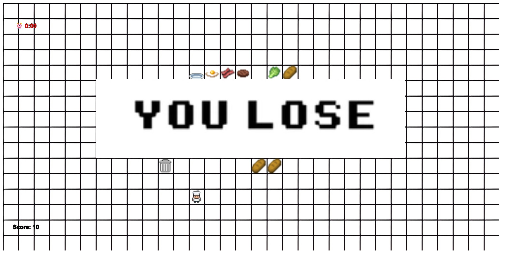

UTN - Facultad Regional Buenos Aires - Materia Paradigmas de Programación

## Equipo de desarrollo:

- Chen, Leandro 
- De Vito Caceres, Fabricio
- Pieronne Hirsch, Alexis
- Vargas, Marisol

## Introducción

- ¡Bienvenidos a la cocina!

DOS CHEFS - UN OBJETIVO

Prepara tantas recetas como puedas, lo que hara que acumules puntos y ganes el juego.

## Capturas

## Reglas de Juego / Instrucciones
- Objetivo: 
  Alcanzar 100 puntos en 2 minutos

### Instrucciones del juego

1. LLeva ingredientes al PLATO
2. Agarra ingredientes con E/ENTER
3. Completa las recetas
4. Gana 10 puntos por cada receta correcta

- Ingredientes:
🍞 Pan, 🥬 Lechuga, 🍅 Tomate
🍔 Carne, 🥓 Bacon, 🥚 Huevo

- RECETAS:
  
• Hamburguesa: Pan + Carne

• Hamburguesa Completa: Pan + Carne + Lechuga + Tomate

• Sandwich Bacon: Pan + Bacon + Lechuga + Tomate

• Ensalada: Lechuga + Tomate

• Desayuno: Huevo + Bacon

### Controles:

- Controles Chef 1:
  
  WASD para que el chef 1 pueda desplazarse

  `E` para tomar el plato o los ingredientes

- Controles Chef 2:
   
  FLECHAS (arriba,abajo,izquierda,derecha) para que el chef 2 pueda desplazarse

  `ENTER` para tomar el plato o los ingredientes 

## Explicaciones teóricas y diagramas

Este proyecto implementa los principios fundamentales de la Programación Orientada a Objetos mediante el desarrollo de un juego de cocina. La arquitectura del sistema se estructura alrededor de clases como Chef, Comida y Receta, que implementan encapsulación, protegiendo sus atributos internos y exponiendo solo la funcionalidad necesaria. La herencia se implementa mediante la clase Chef2 que extiende Chef, sobrescribiendo el método configurarTeclas() para asignar controles diferentes (teclas de flecha) mientras mantiene la misma interfaz de movimiento. Adicionalmente, el sistema emplea polimorfismo a través de objetos dirección (izquierda, derecha, arriba, abajo) que responden al mismo mensaje mover() con comportamientos específicos para cada orientación. 

La colaboración entre objetos se evidencia en el flujo de mensajes donde instancias de Chef interactúan con Plato y SistemaDeRecetas, creando un sistema de objetos que cooperan para lograr el objetivo del juego. Este diseño no solo facilita la mantenibilidad y extensibilidad del código, sino que también sirve como caso de estudio práctico para comprender cómo los conceptos teóricos del paradigma de objetos se materializan en aplicaciones interactivas complejas.

## Diagrama estático 

https://lucid.app/lucidchart/424da17c-27be-4838-b062-df629ca750aa/view

