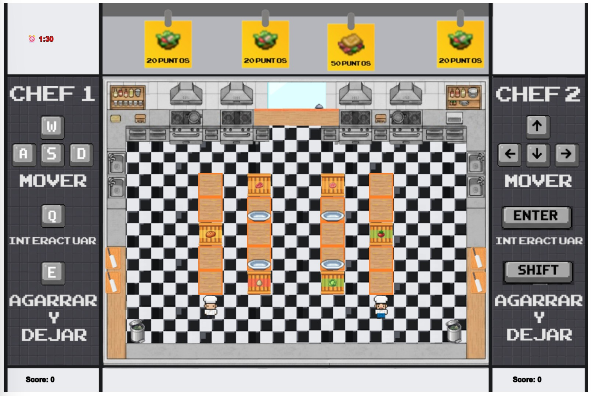
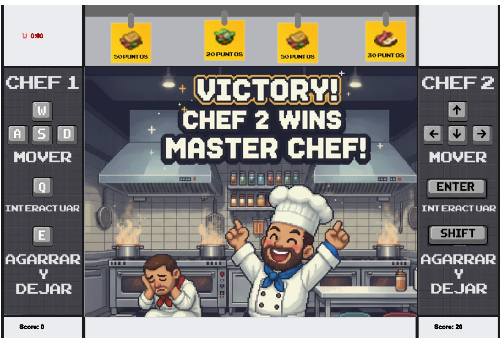
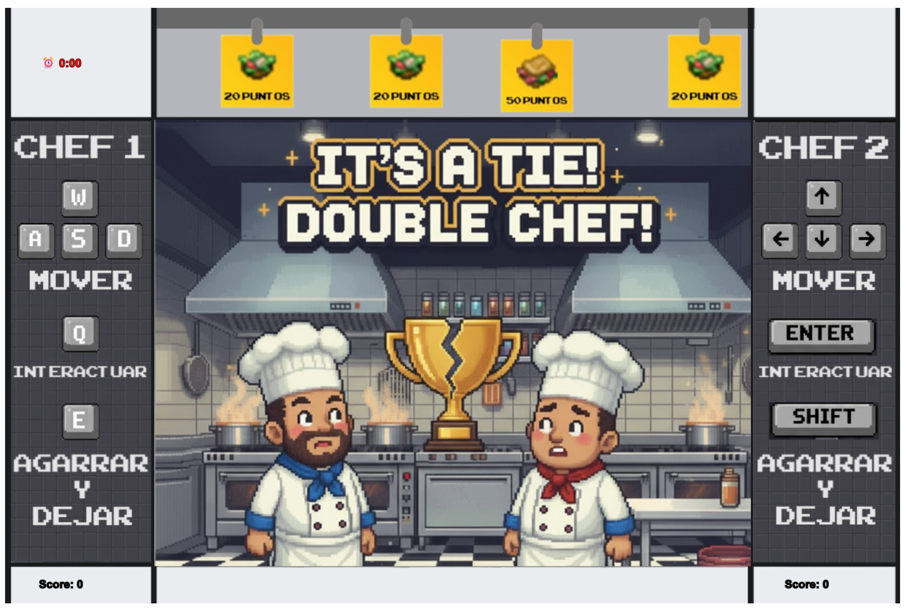

UTN - Facultad Regional Buenos Aires - Materia Paradigmas de Programación

## Equipo de desarrollo:

- Chen, Leandro 
- De Vito Caceres, Fabricio
- Pieronne Hirsch, Alexis
- Vargas, Marisol

## Introducción

- ¡Bienvenidos a la cocina!

DOS CHEFS - UNA COMPETENCIA

Prepara recetas con el límite del tiempo y compite con otro chef para ver quién obtiene más puntos antes de que se acabe el tiempo.

## Capturas

## Reglas de Juego / Instrucciones
- Objetivo: 
  Ganar más puntos que el oponente en 2 minutos preparando recetas completas.

### Instrucciones del juego

1. Genera ingredientes acercándote a los generadores y presionando Q/SHIFT
2. Prepara ingredientes en tablas de cortar y hornos
3. Lava platos sucios en el lavavajillas
4. Lleva ingredientes al PLATO
5. Entrega recetas completas en los cajones de entrega
6. Gana puntos por cada receta correctamente entregada

- Ingredientes:
🍞 Pan, 🥬 Lechuga, 🍅 Tomate
🍔 Carne, 🥓 Bacon, 🥚 Huevo

- RECETAS:
  
• Hamburguesa Completa (50 puntos): Pan + Carne + Lechuga + Tomate

• Sandwich Bacon (50 puntos): Pan + Bacon + Lechuga + Tomate

• Ensalada (20 puntos): Lechuga + Tomate

• Desayuno Bacon-Huevo (30 puntos): Huevo + Bacon

### Controles:

- Controles Chef 1:
  
  WASD para que el chef 1 pueda desplazarse

  `E` para tomar/soltar el plato o los ingredientes

  `Q` para generar/cocinar

- Controles Chef 2:
   
  FLECHAS (arriba,abajo,izquierda,derecha) para que el chef 2 pueda desplazarse

  `ENTER` para tomar el plato/soltar o los ingredientes 

  `SHIFT` para generar/cocinar

## Explicaciones teóricas y diagramas

Este proyecto implementa los principios fundamentales de la Programación Orientada a Objetos mediante el desarrollo de una competencia de cocina. La arquitectura del sistema se estructura alrededor de clases como Chef, Comida y Receta, que implementan encapsulación, protegiendo sus atributos internos como ingredientes, position y estadoDePreparacion, exponiendo solo interfases controladas mediante métodos como agregarIngrediente(), todoComible() e ingredienteListo(). 

La herencia se manifiesta a través de la jerarquía de clases donde Cajon y Tacho extienden ContenedorDeIngredientes, mientras que elementos interactivos como Horno, Tabla y Lavavajilla comparten responsabilidades mediante interfaces comunes. El polimorfismo se manifiesta en múltiples niveles: en el sistema de direcciones donde objetos como izquierda, derecha, arriba y abajo responden al mismo mensaje mover() con comportamientos específicos; y en el sistema de interacciones donde diferentes objetos implementan interactuarCon(chef) con lógicas particulares para cada estación de trabajo. 

La colaboración entre objetos se evidencia en el flujo de mensajes donde los Chef coordinan con GeneradorComida para producir ingredientes, procesan alimentos mediante interacciones con Tabla y Horno, gestionan el estado de Plato que consulta al SistemaDeRecetas para validar combinaciones, y finalmente entregan recetas completas a través de Cajon que notifica al SistemaDePedidos con el fin de actualizar el Marcador.

A modo de conclusión, podemos afirmar que este diseño está caracterizado por bajo acoplamiento y alta cohesión, no solo facilita la mantenibilidad y extensibilidad del código - permitiendo agregar nuevas recetas, ingredientes y estaciones de trabajo sin afectar el sistema existente - sino que constituye un caso de estudio representativo sobre la aplicación práctica de paradigmas de POO en el desarrollo de aplicaciones interactivas complejas con múltiples agentes concurrentes.

## Diagrama estático 

https://lucid.app/lucidchart/424da17c-27be-4838-b062-df629ca750aa/view

